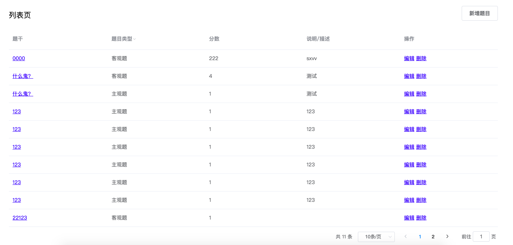
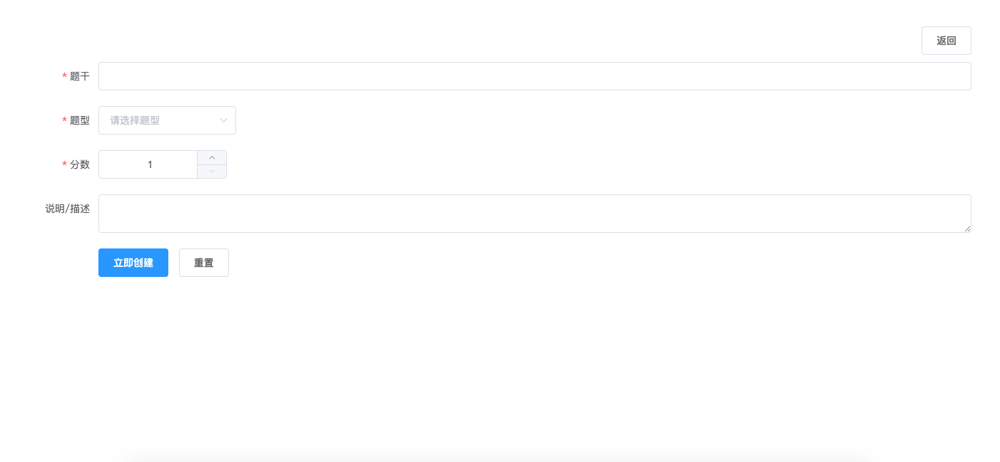
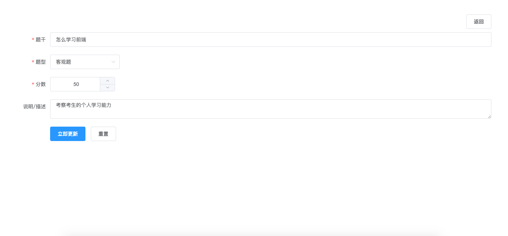
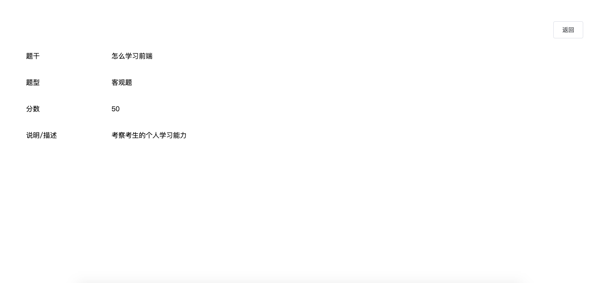

## 技术选型

- ui 组件 使用 element ui
- 框架使用 vue
- 后台接口 express 搭建

  - 文件里的 server 是搭建好的后台接口服务器
  - 进入 server 文件夹先安装依赖 `npm i`
  - 启动项目运行指令 `npm run dev`
  - 项目的默认地址是 `localhost:3000`
  - 具体接口地址查看 `接口文档`

## 需求

#### 列表页

##### 功能

1. 查询所有的题目数据
2. 表格字段包含：题干，题目类型，分数，说明/描述，操作
3. 带分页功能，可以切换分页大小
4. 题目类型支持筛选，筛选支持多选，筛选项有主观题，客观题，列表请求后台接口

- 筛选框展示题型列表，下侧有筛选，重置按钮，点击筛选对题目进行筛选请求，点击重置，重置已选的筛选条件

5. 点击题干可以跳转到题目详情页，查看到题目的详情数据
6. 操作列有编辑，删除操作

- 点击编辑，跳转到编辑题目页
- 点击删除，弹框确认是否删除题目，确认则删除

7. 右侧有新增题目按钮，点击跳转到新增题目页面

#### 新增题目页

##### 功能

1. 题目数据包含题干，题目类型，分数，说明/描述

- 题干字数限制 100 个，最少为 5 个，必填字段，校验不通过提示“请输入题干”
- 题型，下拉选择，列表是请求后台接口获取的数据，暂时有主观题，客观题两项，必填，校验不通过提示“请选择题型”
- 分数，只能输入数字，不能为 0，必填，校验不通过提示“请输入分数”
- 说明/描述，关于题目的说明，选填字段

2. 按钮

- 立即创建按钮，点击校验整个表单，校验不通过的项下则红字提示用户，提示文案在字段说明中有，如果校验通过则创建题目，创建成功提示“题目创建成功”（组件使用 element 的 Message 做提示）
- 重置按钮，点击重置整个表单的数据
- 返回按钮，点击返回到上一个页面

#### 编辑题目页

##### 功能

1. 功能类似新增题目页面，只是下侧按钮改为立即更新
2. 点击立即更新则更新当前题目的信息
3. 其他功能参考新增题目

#### 题目详情页

##### 功能

1. 展示题目的详情，包含字段：题干，题型，分数，说明/描述
2. 右侧有返回按钮，点击返回到上一个页面
